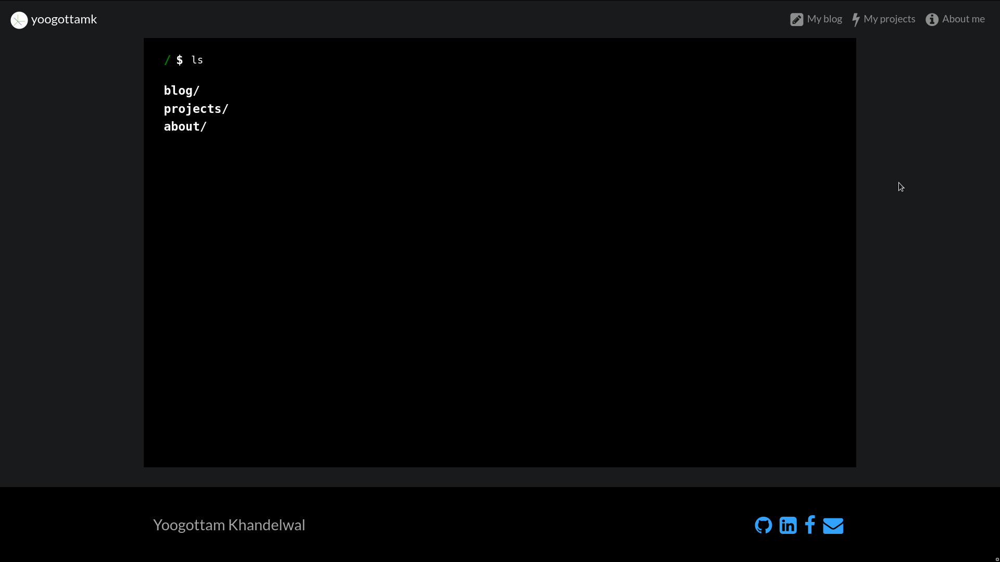
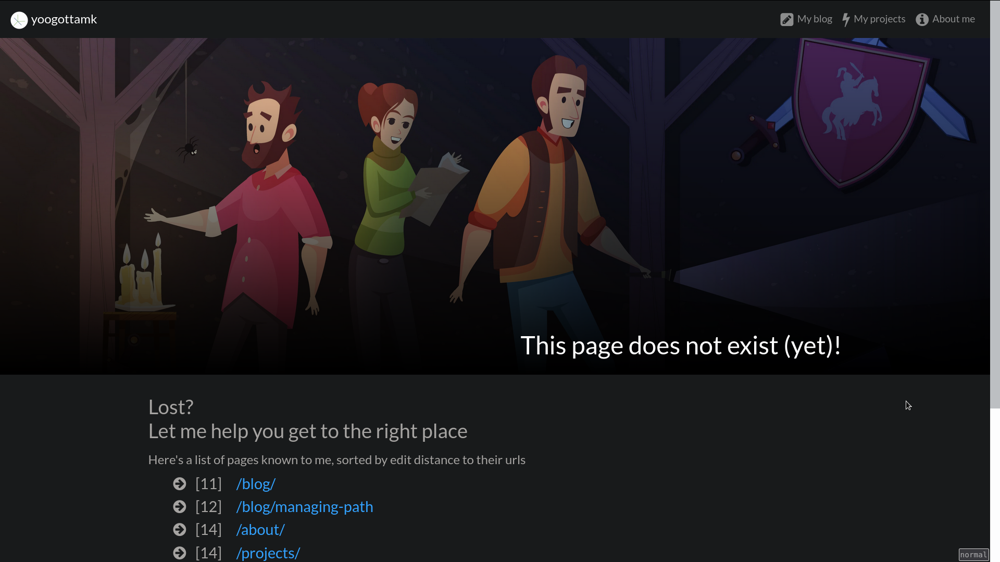

# About the website
This website is written using [jekyll](https://jekyllrb.com/). The theme was made from scratch.

Deployment is done after adding browser prefixes and minifying css/js files using [gulp](https://gulpjs.com/).

# Highlights
 - I request you to visit the [homepage](https://yoogottamk.github.io/) 😛, which features a unix like shell to navigate the website (*WARNING: it may not work perfectly*).

  - Don't miss the [custom 404 page](https://yoogottamk.github.io/blog/oops-a-typo), which lists out available links sorted by edit distance to their urls, really helpful when you are off by a character or two.

   - Do check out the [blog](https://yoogottamk.github.io/blog/), where I intend to add a lot of helpful articles

